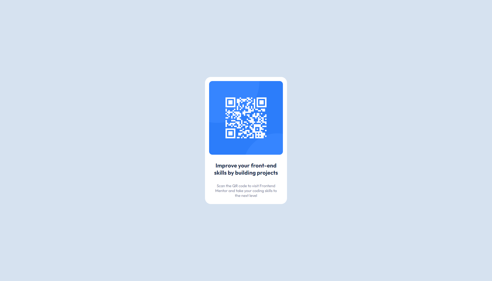
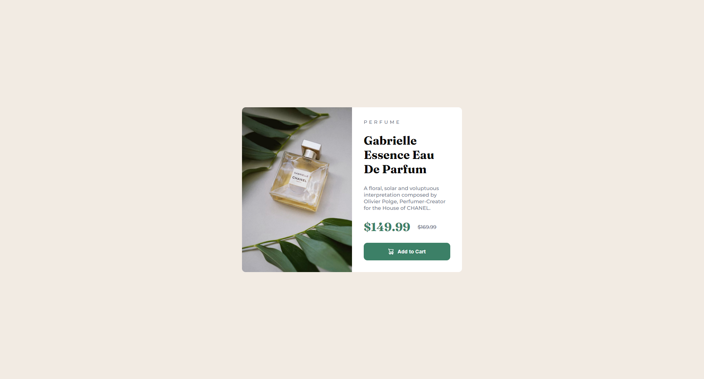

# frontenmentor.io
My own Frontenmentor.io Solutions

Made By [Nepcen](https://www.linkedin.com/in/yusufabacik/)

## List

- [QR code component](https://github.com/Nepcen/frontenmentor.io#qr-code-component)
- [Product preview card component](https://github.com/Nepcen/frontenmentor.io#product-preview-card-component)

## QR Code Component

- [Live Site](https://nepcen.github.io/QR-code-component/)  |  [Repo](https://github.com/Nepcen/QR-code-component)  |  [Solution](https://www.frontendmentor.io/solutions/card-with-htmlandcss-pbx38VZO1C)  |  [Challange](https://www.frontendmentor.io/challenges/qr-code-component-iux_sIO_H)

## Product Preview Card Component

- [Live Site](https://Nepcen.github.io/product-preview-card-component/)  |  [Repo](https://github.com/Nepcen/product-preview-card-component)  |  [Solution](https://www.frontendmentor.io/solutions/product-preview-card-with-htmlandscss--haQTlRgt6)  |  [Challange](https://www.frontendmentor.io/challenges/product-preview-card-component-GO7UmttRfa)
